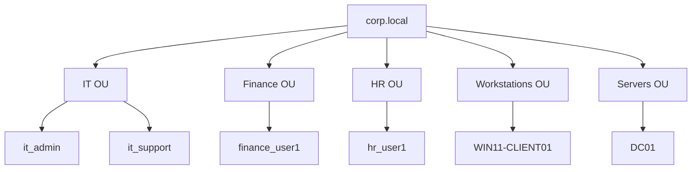

Overview
  This document explains how users and workstations were added to the Active Directory environment in the IT Support Home Lab.

Domain name:
  corp.local

Organizational Unit Structure
  To simulate a real enterprise environment, departmental Organizational Units(OUs) were created in Active Directory.

  The following departments were configured:
    - IT  
    - Finance
    - HR

OU Structure:

 Each Department can cotain its own users, groups, and computers. This allows administrators to apply different Group Policies and permissions to each department.

  Using Organizational Units allows centralized management of users and simplifies administrative tasks in enterprise environments.
